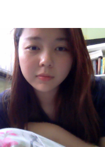
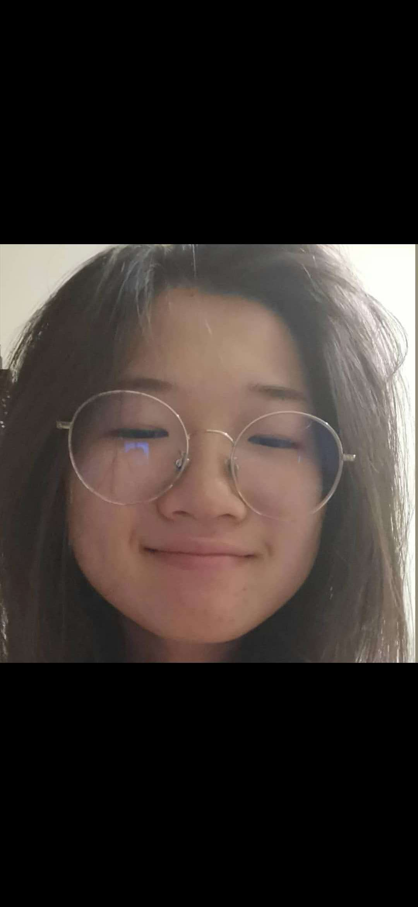

We are a team based in the [School of Computing, National University of Singapore](http://www.comp.nus.edu.sg).

You can reach us at the email `seer[at]comp.nus.edu.sg`

## Project team

### Cai Jialin

[[github](https://github.com/jialin7878)]
[[portfolio](team/jialin7878.md)]

* Role: Developer

### Jane Doe

[[github](http://github.com/calistaio)]
[[portfolio](team/calistaio.md)]

* Role: Team Lead
* Responsibilities: UI

### Gan Jing Wen

[[github](http://github.com/gan-jw)] [[portfolio](team/ganjingwen.md)]

* Role: Developer
* Responsibilities: Data

### Jean Doe

[[github](http://github.com/johndoe)]
[[portfolio](team/johndoe.md)]

* Role: Developer
* Responsibilities: Dev Ops + Threading

### James Doe

[[github](http://github.com/johndoe)]
[[portfolio](team/johndoe.md)]

* Role: Developer
* Responsibilities: UI

### Wu Zeying

[[github](http://github.com/zeying99)]
[[portfolio](team/wuzeying.md)]

* Role: Developer
* Responsibilities: documentation
